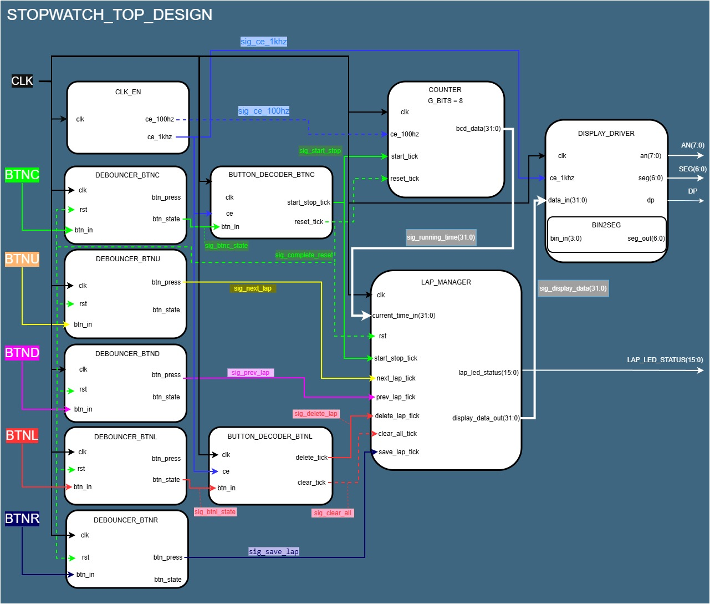
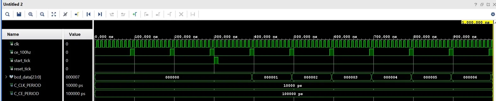
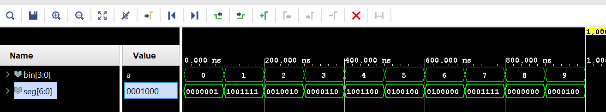
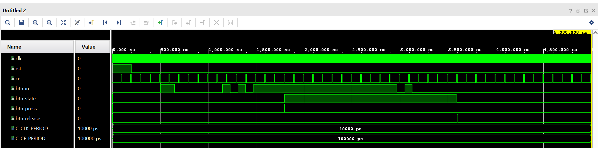
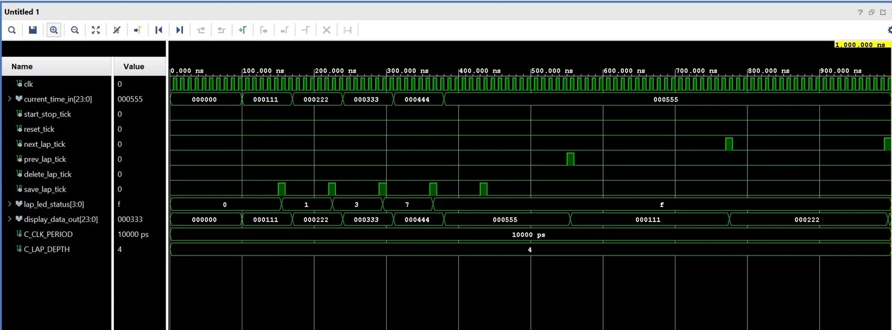

# Projekt: Digital Stopwatch (Lap) - Dig. Elektronika 1

## 1. Problem Description
Cílem tohoto projektu je návrh a implementace digitálních stopek s pokročilou funkcí ukládání a správy mezičasů (Lap) na FPGA desce Nexys A7-50T. Stopky jsou schopny měřit čas s přesností na setiny sekundy. Zobrazování probíhá na 8místném 7segmentovém displeji pomocí multiplexování. Zařízení se plně ovládá pomocí pěti fyzických tlačítek (křížový ovladač), jejichž signály jsou hardwarově ošetřeny proti mechanickým zákmitům (debouncing) a dekódovány pro rozeznání krátkého a dlouhého stisku.

## 2. Ovládání stopek (Hardware Interface)
Systém využívá pět tlačítek na desce Nexys A7. Následující tabulka popisuje jejich funkce:

| Tlačítko | Akce | Funkce |
| :---: | :---: | :--- |
| **BTNC** (Center) | Stisk | **START / STOP** (Spuštění nebo pozastavení času) |
| **BTNC** (Center) | Podržení | **COMPLETE RESET** (Celkové vynulování systému a paměti) |
| **BTNR** (Right) | Stisk | **SAVE LAP** (Zaznamenání aktuálního mezičasu do paměti) |
| **BTNL** (Left) | Stisk | **DELETE LAP** (Smazání aktuálně zobrazeného mezičasu) |
| **BTNL** (Left) | Podržení | **CLEAR ALL** (Vymazání celé paměti mezičasů) |
| **BTNU** (Up) | Stisk | **NEXT LAP** (Listování v paměti směrem k novějším) |
| **BTND** (Down) | Stisk | **PREV LAP** (Listování v paměti směrem ke starším) |

## 3. System Architecture & Block Diagram
Návrh je striktně modulární. Celý systém je rozdělen do specializovaných bloků (VHDL entit), které spolu komunikují přes definované sběrnice a řídicí signály.

### Přehled jednotlivých modulů
| Název modulu | Typ | Hlavní funkce a popis |
| :--- | :--- | :--- |
| **CLK_EN** | Generátor pulzů | Dělí hlavní 100MHz hodiny desky. Vytváří povolovací signály (Clock Enable) s frekvencí `100 Hz` (pro čítání času) a `1 kHz` (pro multiplexování displeje a vzorkování tlačítek). |
| **DEBOUNCER** | Vstupní filtr | 5 instancí pro každé tlačítko. Odstraňuje mechanické zákmity a generuje "čistý" stav (`btn_state`) a detekci stisku na jednu hranu hodin (`btn_press`). |
| **BUTTON_DECODER** | Časovač stisku | 2 instance (pro BTNC a BTNL). Měří délku stisku vyčištěného tlačítka a rozlišuje krátký stisk (Tick) a dlouhé podržení (Hold). |
| **COUNTER** | Čítač času | Jádro stopek. Počítá setiny sekundy na základě 100Hz pulzu. Odesílá neustále běžící čas (32-bit BCD) do správce paměti. |
| **LAP_MANAGER** | Správa paměti | "Mozek" stopek. Obsahuje pole (RAM) pro uložení mezičasů. Zpracovává příkazy tlačítek a rozhoduje, zda se na displej pošle aktuální živý čas, nebo vyvolaný mezičas z paměti. |
| **DISPLAY_DRIVER** | Budič periferie | Stará se o multiplexování 8místného 7segmentového displeje. Obsahuje vnitřní převodník `BIN2SEG` pro překlad BCD dat na segmenty. |

## 4. Internal Signals (Propojovací sběrnice)
Propojení modulů (tzv. "dráty" v Top-Level VHDL souboru) je realizováno pomocí následujících signálů:

**Povolovací signály (Clock Enables):**
| Název signálu | Typ | Zdroj | Cíl | Popis |
| :--- | :--- | :--- | :--- | :--- |
| `sig_ce_100hz` | `std_logic` | `CLK_EN` | `COUNTER` | Pulz každou setinu sekundy. Řídí rychlost čítání stopek. |
| `sig_ce_1khz` | `std_logic` | `CLK_EN` | Ostatní moduly | Řídí rychlost debouncingu, měření délky stisku a obnovovací frekvenci displeje. |

**Řídicí pulzy a stavy tlačítek:**
| Název signálu | Typ | Zdroj | Cíl | Popis |
| :--- | :--- | :--- | :--- | :--- |
| `sig_start_stop` | `std_logic` | `DECODER_BTNC` | `COUNTER`, `LAP_MANAGER` | Přepíná běh stopek / vrací displej z prohlížení do živého času. |
| `sig_complete_reset` | `std_logic` | `DECODER_BTNC` | Všechny paměťové bloky | Tvrdý reset - vynuluje čas i celou paměť (Hold BTNC). |
| `sig_save_lap` | `std_logic` | `DEBOUNCER_BTNR` | `LAP_MANAGER` | Uloží aktuální běžící čas do volného slotu v paměti. |
| `sig_next_lap` | `std_logic` | `DEBOUNCER_BTNU` | `LAP_MANAGER` | Posun ukazatele paměti vpřed. |
| `sig_prev_lap` | `std_logic` | `DEBOUNCER_BTND` | `LAP_MANAGER` | Posun ukazatele paměti vzad. |
| `sig_delete_lap` | `std_logic` | `DECODER_BTNL` | `LAP_MANAGER` | Smaže právě prohlížený mezičas a posune ostatní záznamy. |
| `sig_clear_all` | `std_logic` | `DECODER_BTNL` | `LAP_MANAGER` | Vymaže paměť mezičasů, ale stopky nechá běžet (Hold BTNL). |

**Datové sběrnice:**
| Název signálu | Typ | Zdroj | Cíl | Popis |
| :--- | :--- | :--- | :--- | :--- |
| `sig_running_time` | `vector(31:0)` | `COUNTER` | `LAP_MANAGER` | 32bitový BCD vektor představující aktuální živý čas. |
| `sig_display_data` | `vector(31:0)` | `LAP_MANAGER` | `DISPLAY_DRIVER` | Data odesílaná k zobrazení (buď `sig_running_time` nebo čas z paměti). |

## 5. Git Flow & Team
Odkaz na historii commitů, která prokazuje kooperativní vývoj:
[Commit History](https://github.com/xeenwastaken/DE1-Digital-Stopwatch/commits/main/)
* **Student A:** (Žalud Jakub) - Architektura, Top-Level design, LAP_MANAGER, README dokumentace.
* **Student B:** (Martinec Robert) - Implementace čítačů, budiče displeje, testování na hardwaru.

## 6. Simulation & Verification (Waveforms)
Pro ověření správné funkce všech modulů byly vytvořeny testbenche a provedeny behaviorální simulace v prostředí Vivado. Následující průběhy potvrzují logickou správnost návrhu.

### 6.1 BCD Counter & Clock Enable
Detailní pohled na synchronizaci hlavního čítače s povolením hodin (`ce_100hz`). Je patrné, že data se mění přesně s náběžnou hranou signálu CE, což zajišťuje stabilitu systému.
| Modul | Soubor simulace | Popis |
| :--- | :--- | :--- |
| **COUNTER** | `tb_counter.vhd` | Přičítání hodnot v BCD formátu (0, 1, 2...) synchronizované s 100Hz pulzem. |

---

### 6.2 7-segment Decoder (Bin2Seg)
Ověření kombinační logiky převodníku. Simulace ukazuje správné namapování číselných hodnot 0 až 9 na odpovídající segmenty displeje (aktivní v logické nule).
| Modul | Soubor simulace | Popis |
| :--- | :--- | :--- |
| **BIN2SEG** | `tb_bin2seg.vhd` | Sekvenční testování vstupních hodnot 0–9 a kontrola výstupního vektoru `seg[6:0]`. |

---

### 6.3 Button Management (Debounce & Decoder)
Simulace ošetření tlačítek. Je zde vidět filtrace zákmitů a následné rozlišení mezi krátkým impulzem (`tick_out`) a logikou pro dlouhé podržení (`hold_out`).
| Modul | Soubor simulace | Popis |
| :--- | :--- | :--- |
| **BUTTON_DECODER** | `tb_button decoder.vhd` | Detekce délky stisku; `hold_out` se aktivuje po definovaném počtu vzorků. |

---

### 6.4 Lap Manager & Memory Logic
Komplexní test správy mezičasů. Simulace zachycuje uložení času do paměti (`save_lap_tick`), inkrementaci počtu uložených záznamů a změnu stavu indikačních LED.
| Modul | Soubor simulace | Popis |
| :--- | :--- | :--- |
| **LAP_MANAGER** | `tb_lap manager.vhd` | Práce s indexy paměti a přepínání mezi živým časem a uloženým mezičasem na výstupu. |

## 7. Resource Report (Post-Synthesis)
*(Bude doplněno po finální syntéze ve Vivado 2025.2 pro čip Artix-7 xc7a50ticsg324-1L)*

| Resource | Utilization | Available | Utilization % |
| :--- | :--- | :--- | :--- |
| LUT | *TBD* | 32600 | *TBD* % |
| FF | *TBD* | 65200 | *TBD* % |
| IO | *TBD* | 210 | *TBD* % |
| BRAM | *TBD* | 75 | *TBD* % |

## 8. Other Outputs
* **Video Demonstration:** [https://www.youtube.com/shorts/TZS5_5ajEPg]
* **Project Poster:** [TBD - Link na PDF]
* **Zdroje:** Přednášky a cvičení BPC-DE1 (VUT FEKT), referenční manuál k desce Nexys A7.
